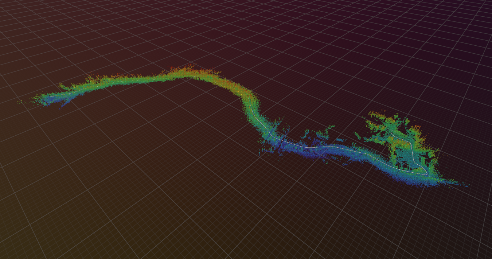
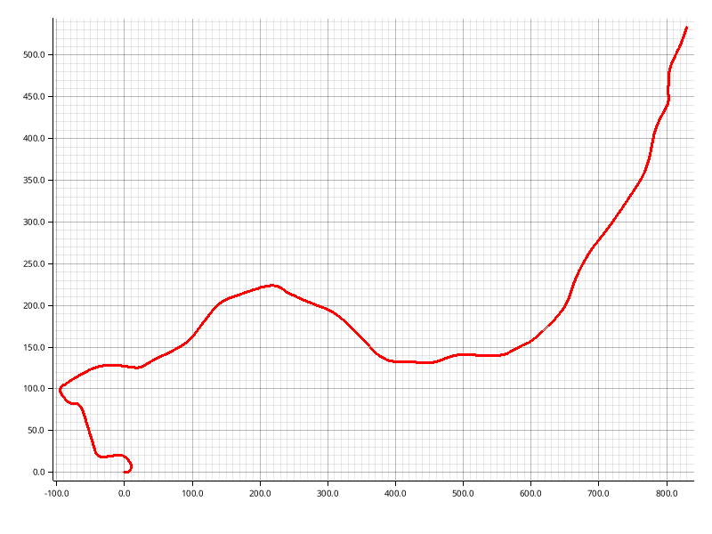
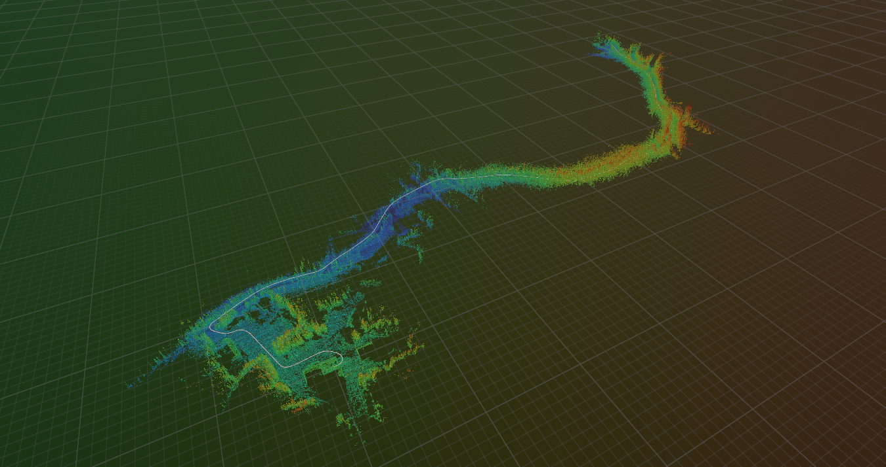

# uvt-rs

This workspaces provides crates to interact with files in the _Uncrewed Vehicle Trajectory_ (UVT) format.
The UVT format is an extension of the LTR file format introduced in [_Kilometer-Scale Autonomous Navigation in Subarctic Forests: Challenges and Lessons Learned_](https://doi.org/10.55417/fr.2022050).

<table>
  <thead>
    <tr>
      <td>
        
      </td>
      <td>
        
      </td>
      <td>
        
      </td>
    </tr>
  </thead>
</table>

## Highlights

<!-- TODO: Add highlights -->

```rs
use example;
fn main() {
  example::function(5, 2);
}
```

## Citation

If you use the code or data in an academic context, please cite the following work:

```bibtex
@article{Baril2022,
  title = {Kilometer-Scale Autonomous Navigation in Subarctic Forests: Challenges and Lessons Learned},
  volume = {2},
  ISSN = {2771-3989},
  url = {http://dx.doi.org/10.55417/fr.2022050},
  DOI = {10.55417/fr.2022050},
  journal = {Field Robotics},
  publisher = {Institute of Electrical and Electronics Engineers (IEEE)},
  author = {Baril,  Dominic and Desch\^enes,  Simon-Pierre and Gamache,  Olivier and Vaidis,  Maxime and LaRocque,  Damien and Laconte,  Johann and Kubelka,  Vladimír and Giguère,  Philippe and Pomerleau,  Fran\c{c}ois},
  year = {2022},
  month = jul,
  pages = {1628–1660}
}
```

## License

Licensed under either of

 * Apache License, Version 2.0
   ([LICENSE-APACHE](LICENSE-APACHE) or <http://www.apache.org/licenses/LICENSE-2.0>)
 * MIT license
   ([LICENSE-MIT](LICENSE-MIT) or <http://opensource.org/licenses/MIT>)

at your option.

## Contribution

Unless you explicitly state otherwise, any contribution intentionally submitted
for inclusion in the work by you, as defined in the Apache-2.0 license, shall be
dual licensed as above, without any additional terms or conditions.
