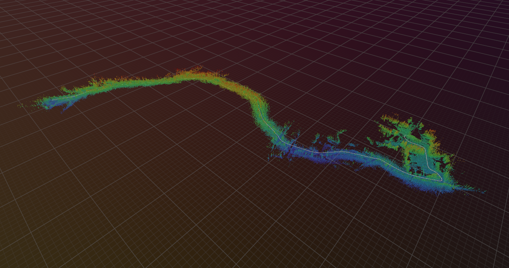

# uvt-viz3d

[](https://crates.io/crates/uvt-viz3d)
[](https://docs.rs/uvt-viz3d)

<table>
  <thead>
    <tr>
      <td>
        
      </td>
      <td>
        
      </td>
    </tr>
  </thead>
</table>

This crate provides utilities to visualize the content of an _Uncrewed Vehicle Trajectory_ (UVT) file in 3D, with [rerun](https://rerun.io).
The UVT format is an extension of the LTR file format introduced in [_Kilometer-Scale Autonomous Navigation in Subarctic Forests: Challenges and Lessons Learned_](https://doi.org/10.55417/fr.2022050).

A UVT file contains:

- a LiDAR map of the environment, stored in the [`VTK` format](https://vtk.org).
- A trajectory recorded by an uncrewed vehicle.

An example UVT file is available on [Zenodo](https://doi.org/10.5281/zenodo.16928365).

## Usage

Since `uvt-viz3d` relies on [`rerun`](https://rerun.io), you might need to install Rerun Viewer. Installations infos are available [here](https://rerun.io/docs/getting-started/installing-viewer)

### CLI tool

To use `uvt-viz3d` as a CLI tool, you can install this crate with:

```sh
cargo install uvt-viz3d
```

You can run `uvt-viz3d` from the terminal:

```console
$ uvt-viz3d --help
Utilities for visualizing UVT data in 3D

Usage: uvt-viz3d [OPTIONS] --input-file <INPUT_FILE>

Options:
  -i, --input-file <INPUT_FILE>  Input file path
  -m, --mode <MODE>              File mode [default: uvt] [possible values: uvt, rosbag, mcap]
      --map-topic <MAP_TOPIC>    Map topic [default: /map]
      --traj-topic <TRAJ_TOPIC>  Trajectory topic [default: /odom]
  -h, --help                     Print help
  -V, --version                  Print version
```

`uvt-viz3d` can be used with `.uvt` files and with rosbags, both with ROS (`.bag`) and with ROS 2 (`.mcap`):

```sh
# With a UVT file
uvt-viz3d -- --input-file example.uvt

# With a ROS bag file
uvt-viz3d -- --input-file example.bag --m rosbag --map-topic /my-map-topic --traj-topic /my-traj-topic

# With a ROS MCAP file
uvt-viz3d -- --input-file example.mcap --m mcap --map-topic /my-map-topic --traj-topic /my-traj-topic
```

### Library

To use `uvt-viz3d` as a library, simply add the crate name to your `Cargo.toml` file:

```rust
[dependencies]
uvt-viz3d = "0.1"
```

`uvt-viz3d` provides a function to visualize the content of a UVT file:

```rs
use std::io;
use uvt;
use uvt_viz3d;

fn main() -> Result<(), io::Error> {
    // Open a UVT file
    let my_uvt = uvt::Uvt::read_file("example.uvt")?;

    // Visualize uvt with rerun
    uvt_viz3d::show_uvt(my_uvt);

    Ok(())
}
```

## Citation

If you use the code or data in an academic context, please cite the following work:

```bibtex
@article{Baril2022,
  title = {Kilometer-Scale Autonomous Navigation in Subarctic Forests: Challenges and Lessons Learned},
  volume = {2},
  ISSN = {2771-3989},
  url = {http://dx.doi.org/10.55417/fr.2022050},
  DOI = {10.55417/fr.2022050},
  journal = {Field Robotics},
  publisher = {Institute of Electrical and Electronics Engineers (IEEE)},
  author = {Baril,  Dominic and Desch\^enes,  Simon-Pierre and Gamache,  Olivier and Vaidis,  Maxime and LaRocque,  Damien and Laconte,  Johann and Kubelka,  Vladimír and Giguère,  Philippe and Pomerleau,  Fran\c{c}ois},
  year = {2022},
  month = jul,
  pages = {1628–1660}
}
```

## License

Licensed under either of

 * Apache License, Version 2.0
   ([LICENSE-APACHE](LICENSE-APACHE) or <http://www.apache.org/licenses/LICENSE-2.0>)
 * MIT license
   ([LICENSE-MIT](LICENSE-MIT) or <http://opensource.org/licenses/MIT>)

at your option.

## Contribution

Unless you explicitly state otherwise, any contribution intentionally submitted
for inclusion in the work by you, as defined in the Apache-2.0 license, shall be
dual licensed as above, without any additional terms or conditions.
